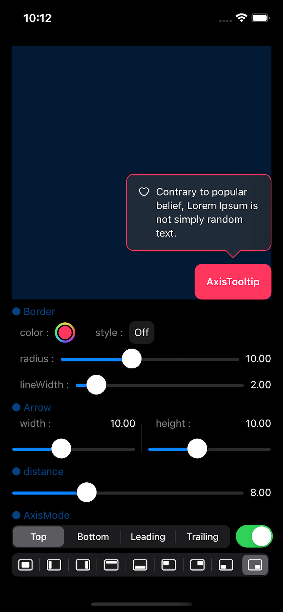
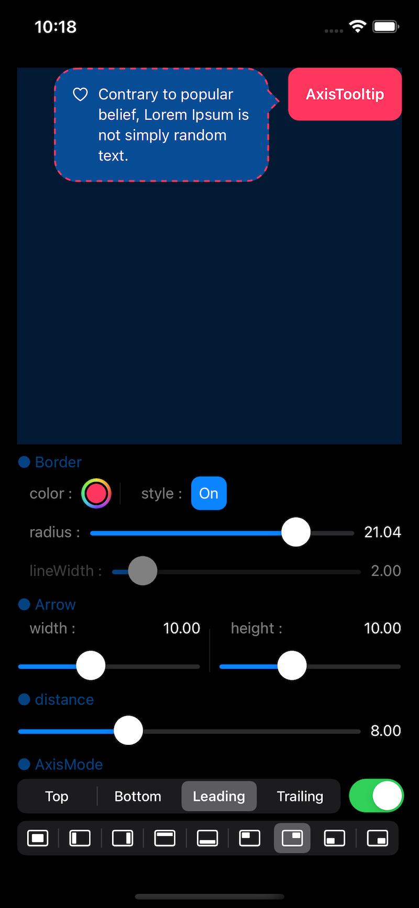
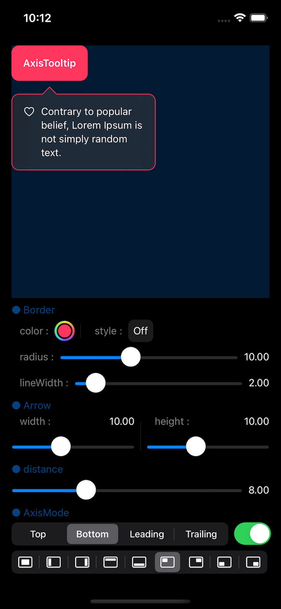
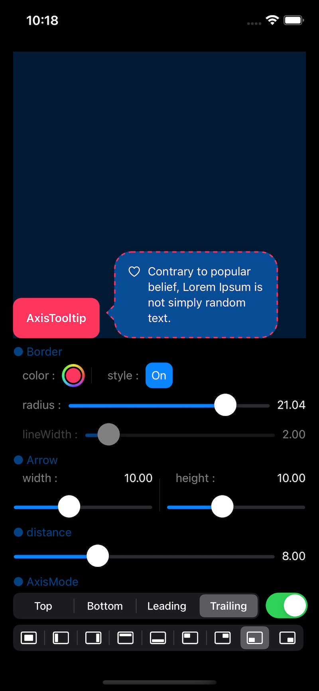

# **AxisTooltip for SwiftUI**
A library that displays tooltips in the desired view. Supports iOS and macOS.

[](https://developer.apple.com/macOS)
[](https://developer.apple.com/iOS)
[](https://developer.apple.com/macOS)
[](https://www.instagram.com/dev.fabula)
[](https://developer.apple.com/documentation/swift_packages/package/)
[](https://opensource.org/licenses/MIT)  

## Screenshot
|Top/Bottom|Leading/Trailing|
|:---:|:---:|
|||
|||

https://user-images.githubusercontent.com/1617304/156180887-8f9f5ece-c4d6-4218-ac9b-275ac76fa071.mov

## Example
[https://fabulaapp.page.link/232](https://fabulaapp.page.link/232)

## Usages
```swift
Text("AxisTooltip")
  .bold()
  .padding()
  .onTapGesture {
      isPresented.toggle()
  }
  .axisToolTip(isPresented: $isPresented, constant: constant, foreground: {
      Label("Contrary to popular belief, Lorem Ipsum is not simply random text.", systemImage: "heart")
          .padding()
          .frame(width: 200)
  })
  // or - Custom background settings.
  // .axisToolTip(isPresented: $isPresented, constant: constant, background: {
  //  Color.blue
  //}, foreground: {
  //    Label("Contrary to popular belief, Lorem Ipsum is not simply random text.", systemImage: "heart")
  //        .padding()
  //        .frame(width: 200)
  //})
```
  
## Swift Package Manager
The Swift Package Manager is a tool for automating the distribution of Swift code and is integrated into the swift compiler. Once you have your Swift package set up, adding AxisTooltip as a dependency is as easy as adding it to the dependencies value of your Package.swift.

```swift
dependencies: [
    .package(url: "https://github.com/jasudev/AxisTooltip.git", .branch("main"))
]
```

## Contact
instagram : [@dev.fabula](https://www.instagram.com/dev.fabula)  
email : [dev.fabula@gmail.com](mailto:dev.fabula@gmail.com)

## License
AxisTooltip is available under the MIT license. See the [LICENSE](LICENSE) file for more info.
